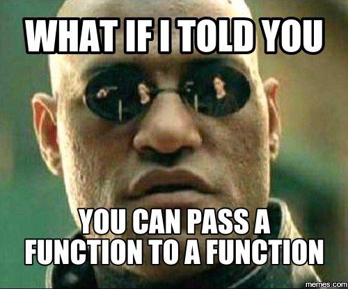
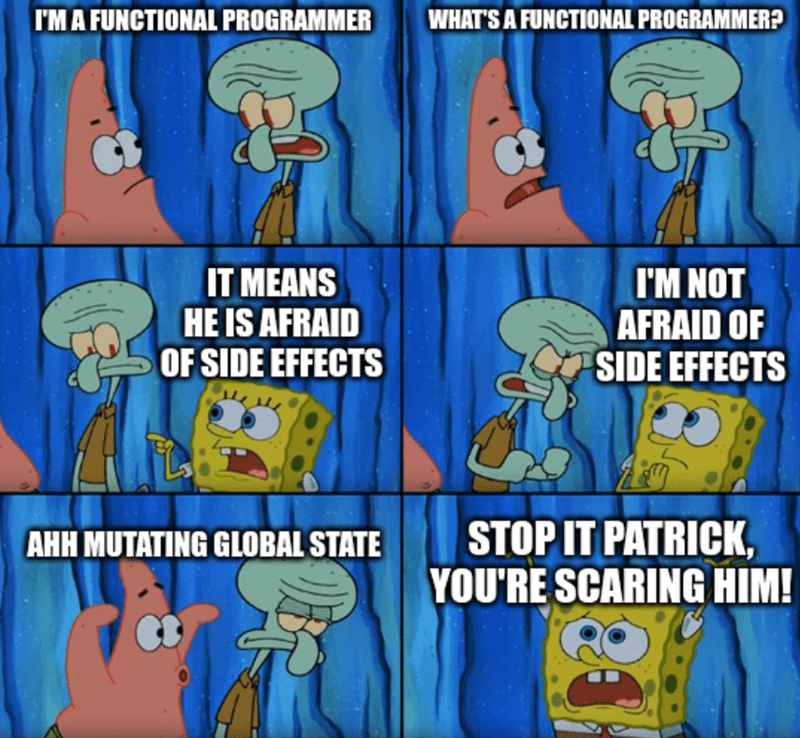
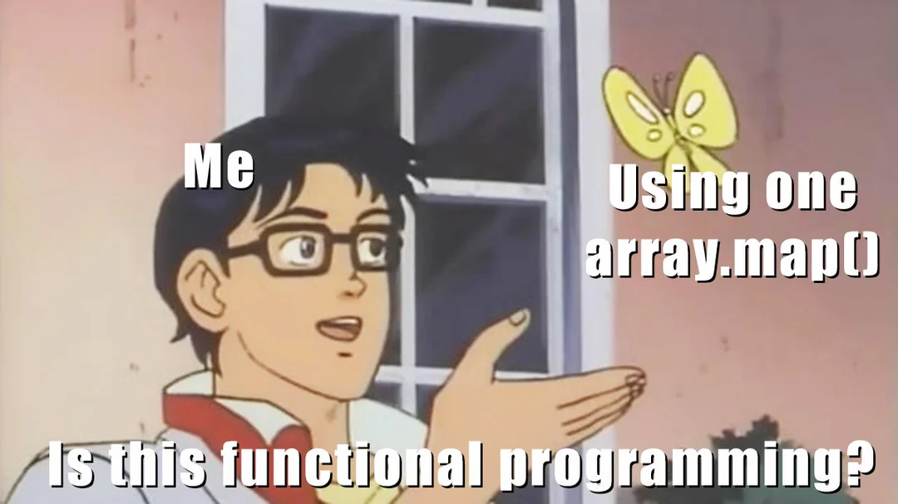
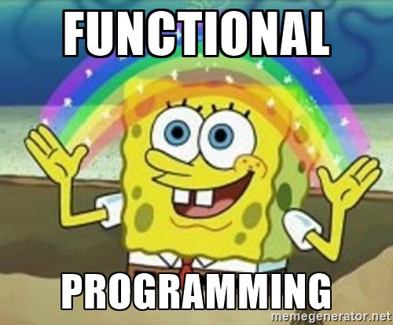

Functional Programming
---

* What is functional programming?
* Where does the idea come from?
* What is it good for?
* How do I use it?

<!-- end_slide -->

Functional Programming
---

> a programming paradigm where functions play the main role

<!-- pause -->


<!-- end_slide -->

Programs in FP
---

* Composed of functions, chained together to perform complex tasks.
* Functions tend to be small and modular.

<!-- end_slide -->

Programs in OOP
---

* Objects play the main role.
* Functions play a part, but are usually used to change the state of an object.

<!-- end_slide -->

On "purity"
---

A subset of FP, with these restrictions:
* A function cannot mutate the state of the system.
* A function cannot produce any side effects.

<!-- pause -->
Benefits:
* Given the same set of inputs, a pure function will always produce the same
  output.

<!-- end_slide -->

Roots - Lambda Calculus
---

* Invented in 1930s by Alonzo Church
* Expresses computation based on function abstraction and application using
  variable binding and substitution.
* `(λx.x)a = a`
* `(λx.y)a = y`

<!-- end_slide -->

Roots - Lisp
---

* 1950s: John McCarthy
* Introduced recursion, first-class functions, garbage collection, conditional
  statements.

```lisp
(defun list-member (E L)
  "Test if E is a member of L."
  (cond
   ((null L)          nil)   
   ((eq E (first L))  t)     
   (t                 (list-member E (rest L)))))
```

<!-- end_slide -->

Roots - APL
---

* 1960s: Kenneth E. Iverson.
* Array-ooriented, mathematically structured.
* Calculate arithmetic mean of a list of numbers: `{(+⌿⍵)÷≢⍵}`

<!-- end_slide -->

Roots - ML
---

* 1973: Robin Milner.
* Introduced "polymorphic Hindley-Milner type system" (automatic type
  inference), function currying, and pattern matching.
* Reverse a list:

```ml
fun reverse [] = []
  | reverse (x :: xs) = (reverse xs) @ [x]
```

<!-- end_slide -->

Roots - Scheme
---

* 1975: Gerald Jay Sussman, Guy L. Steele Jr.
* A dialect of Lisp that used lexical scoping and tail-call optimization.

```scheme
> (define (square x)
    (* x x))
> (square 5)
25
```

<!-- end_slide -->

Roots - FP
---

* 1977: John Backus.
* "Point Free" programming: avoiding named variables.
* Inspired research in other languages.

<!-- end_slide -->

Roots - Miranda
---
* 1985: Miranda: David Turner.
* Introduced lazy evaluation.

```miranda
squares = [ n * n | n <- [1..] ]
```

<!-- end_slide -->

Roots - Haskell
---

* 1990: Lennart Augustsson, Dave Barton, Brian Boutel, Warren Burton, Joseph Fasel, Kevin Hammond, Ralf Hinze, Paul Hudak, John Hughes, Thomas Johnsson, Mark Jones, Simon Peyton Jones, John Launchbury, Erik Meijer, John Peterson, Alastair Reid, Colin Runciman, Philip Wadler.
* Statically typed FP language, with type inference (ML), lazy evaluation (Miranda).

```haskell
-- Using recursion (with guards)
factorial n
   | n < 2     = 1
   | otherwise = n * factorial (n - 1)
```

<!-- end_slide -->

Roots - F#
---
* 2005: Don Syme. Microsoft's .NET language, based on OCaml.

```f#
 seq { for b in 0 .. 25 do
           if b < 15 then
               yield b*b }
```

<!-- end_slide -->


OO languages and FP: Java
---

* pattern matching
* higher order functions
* declarative functions through Lambda functions

<!-- end_slide -->

OO languages and FP: C# - inspired by F#
---

* pattern matching
* immutability
* built-in tuple support.

```java
static void test(Object obj) {
    switch (obj) {
        case String s && (s.length() == 1) -> System.out.println("Short: " + s);
        case String s                      -> System.out.println(s);
        default                            -> System.out.println("Not string");
    }
}
```

<!-- end_slide -->

OO languages and FP: JS
---

* first-class functions
* anonymous functions
* closures

```javascript
function makeAdder(x) {
  return function (y) {
    return x + y;
  };
}

const add5 = makeAdder(5);
const add10 = makeAdder(10);

console.log(add5(2)); // 7
console.log(add10(2)); // 12
```

<!-- end_slide -->

Benefits of FP
---


<!-- end_slide -->

Benefits of FP
---

* deterministic: same input -> same output
  * easier to reason about and test
* not relying on or mutating state -> easier concurrency
  * runing the same pure function concurrently cannot impact the results of
    another function.

<!-- end_slide -->

When *not* to use FP
---

* For performance / memory, it may be necessary to work with pointers.
* In theory, all loops can be replaced by recursion. In practice, this can lead
  to stack overflow errors if the language you're using does not do tail-call
  optimization.

<!-- end_slide -->

Go and FP
---

What is has:
* functions as first-class citizens
* higher-order functions
* immutability guarantees
* generics
* recursion

<!-- pause -->
What it doesn't have:
* tail-call optimization
* lazy evaluation
* purity guarantees

<!-- end_slide -->

First-class functions
---

* Can be passed as arguments to other functions.
* Can be returned as values from other functions.
* Can be assigned to variables.

<!-- end_slide -->

Higher-order Function
---

Any function that either:
* takes a function as an argument.
* returns a function.

<!-- end_slide -->

Passing functions as arguments
---



<!-- end_slide -->

Passing functions as arguments
---

```go +line_numbers {7-13|15-21|23-29}
package main

import (
    "fmt"
)

func IsEven(n int) bool {
    return n%2 == 0
}

func IsOdd(n int) bool {
    return n%2 != 0
}

func CheckMatch(n int, f func(int) bool) {
    if f(n) {
        fmt.Printf("%d matches condition\n", n)
        return
    }
    fmt.Printf("%d does not match!\n", n)
}

func main() {
    fmt.Println("IsEven")
    CheckMatch(2, IsEven)

    fmt.Println("IsOdd")
    CheckMatch(2, IsOdd)
}
```

```sh +exec
go run ./cmd/basics/passfunction
```

<!-- end_slide -->

Returning functions and assigning as values
---

```go +line_numbers {7-15|17-27}
package main

import (
    "fmt"
)

func GetGreetFunc(name string) func() {
    if name == "" {
        name = "World"
    }

    return func() {
        fmt.Println("Hello, " + name + "!")
    }
}

func main() {
    // Call function immediately without assigning to a variable.
    GetGreetFunc("")()
    GetGreetFunc("Gopher")()

    // Assign the function to a variable.
    learnGreetFunc := GetGreetFunc("FP learners")

    // Call the function we returned.
    learnGreetFunc()
}
```

```sh +exec
go run ./cmd/basics/funcasvalue
```

<!-- end_slide -->


Function type alias
---

```go +line_numbers {}
type ServerOptions struct {
    Name string
    Port int
}

type ServerOptionFunc func(ServerOptions) ServerOptions

func ServerName(n string) ServerOptionFunc {
    return func(o ServerOptions) ServerOptions {
        o.Name = n
        return o
    }
}

func ServerPort(p int) ServerOptionFunc {
    return func(o ServerOptions) ServerOptions {
        o.Port = p
        return o
    }
}

func NewServer(opts ...ServerOptionFunc) Server {
    options := ServerOptions{
        Name: "default",
        Port: 8080,
    }
    for _, opt := range opts {
        options = opt(options)
    }

    return Server{options: options}
}

func main() {
    server := NewServer(
        ServerName("my_server"),
        ServerPort(8080),
    )
}
```

<!-- end_slide -->

Function type alias based on real usage
---

```go +line_numbers {1|3-20|22-28}
type EnvironmentFilter func(string) bool

func GetEnvironments(environments []string, filters ...EnvironmentFilter) []string {
    filteredEnvs := []string{}

    for _, env := range environments {
        filtered := false
        for _, f := range filters {
            filtered = f(env)
            if filtered {
                break
            }
        }

        if !filtered {
            filteredEnvs = append(filteredEnvs, strings.ToLower(env))
        }
    }
    return filteredEnvs
}

func ProdEnvFilter(env string) bool {
    return strings.HasPrefix(strings.ToLower(env), "prod")
}

func NonProdEnvFilter(env string) bool {
    return !ProdEnvFilter(env)
}
```

<!-- end_slide -->

Function type alias based on real usage (continued)
---

```go +line_numbers

func main() {
    environments := []string{
        "prod1", "prod2", "PROD3", "staging", "dev", "local",
    }

    fmt.Println(
        "prod envs:", GetEnvironments(environments, ProdEnvFilter))

    fmt.Println(
        "non-prod envs:", GetEnvironments(environments, NonProdEnvFilter))
}
```

```sh +exec
go run ./cmd/basics/typealias
```

<!-- end_slide -->

Variable scoping in Go
---

Lexical scoping: a variable is identified and usable within the context where
it was created.

```go
// Q0: What would be printed?
func main() {
    s := "hello"
    if true {
        s := "world"
        fmt.Println(s)
    }
    fmt.Println(s)
}
```

```sh +exec
go run ./cmd/lexicalscoping/q0
```

<!-- end_slide -->

Scoping
---

```go
// Q1: What would be printed?
func main() {
    s := "hello"
    if true {
        s = "world"
        fmt.Println(s)
    }
    fmt.Println(s)
}
```

```sh +exec
go run ./cmd/lexicalscoping/q1
```

<!-- pause -->

_This is a great example of where using golangci-lint with govet enabled could
help you find bugs due to shadowed variables._

```sh +exec
golangci-lint run \
  -c ./cmd/lexicalscoping/q0/.golangci.yml \
  ./cmd/lexicalscoping/...
```

<!-- end_slide -->

Closures
---

Any inner function that uses a variable introduced in the outer function.

```go +line_numbers
package main

import "fmt"

func adder() func(int) int {
    sum := 0
    return func(x int) int {
        sum += x
        return sum
    }
}

func main() {
    pos, neg := adder(), adder()
    for i := 0; i < 10; i++ {
        fmt.Println(
            pos(i),
            neg(-2*i),
        )
    }
}
```

```sh +exec
go run ./cmd/closure
```

<!-- end_slide -->

Partial application
---

Taking a function that takes N arguments and "fixing" a subset of the
arguments.

Currying: converting a function that takes multiple arguments into a sequence
of functions that each take a single argument.

```go
func Greet(greeting, name string) string {
    return fmt.Sprintf("%s, %s", greeting, name)
}

func PrefixGreet(greeting string) func(string) string {
    return func(name string) string{
        return Greet(greeting, name)
    }
}

func main() {
    gdayFn := PrefixGreet("G'day")
    yoFn := PrefixGreet("Yo")

    fmt.Println(greetFn("Gophers"))
    fmt.Println(yoFn("class"))
}
```

```sh +exec
go run ./cmd/partialapplication
```

<!-- end_slide -->

Safer concurrency
---

What does this program output?

```go
var (
    integers = []int{}
)

func addToSlice(i int, wg *sync.WaitGroup) {
    integers = append(integers, i)
    wg.Done()
}

func main() {
    var wg sync.WaitGroup

    numbersToAdd := 10
    wg.Add(numbersToAdd)

    for i := range numbersToAdd {
        go addToSlice(i, &wg)
    }

    wg.Wait()

    fmt.Println(integers)
}
```

<!-- end_slide -->

Let's find out
---

```sh +exec
for i in $(seq 1 10) ; do
    echo "--- Run ${i} ---"
    go run ./cmd/concurrencysideeffect
done
```

<!-- pause -->

Answer: non-deterministic!

Why? The function is impure, as it has the *side effect* of mutating the slice.

<!-- end_slide -->

Side effects
---



<!-- end_slide -->

On side effects and type signatures
---

```go
type Person struct {
    Name string
    Age uint
}

func SetName(p Person, name string) {
    p.Name = name
}

func main() {
    p := Person{
        Name: "Penelope",
        Age: 39,
    }
    SetName(p, "Penny")
    fmt.Println(p.Name)
}
```

What is the output?

<!-- pause -->

Answer: Penelope.

<!-- end_slide -->

On side effects and type signatures (cont.)
---

```go
func SetName(p *Person, name string) {
    p.Name = name
}

func main() {
    p := Person{
        Name: "Penelope",
        Age: 39,
    }
    SetName(p, "Penny")
    fmt.Println(p.Name)
}
```

What is the output?

<!-- pause -->
Answer: Penny

<!-- end_slide -->

Now with "immutable" structs
---

```go
func SetName(p Person, name string) Person {
    return Person {
        Name: name,
        Age: p.Age,
    }
}

func main() {
    penelope := Person{
        Name: "Penelope",
        Age: 39,
    }
    penny := SetName(p, "Penny")
    fmt.Println(penelope.Name)
    fmt.Println(penny.Name)
}
```

<!-- end_slide -->

Maps & pass-by-reference
---

```go
func addMapValue(m map[string]int, key string, value int) {
    m[key] = value
}

func main() {
    colors := map[string]int{}
    colors["red"] = 10

    fmt.Printf("%v\n", colors) // What is the output?
}
```

What is the output?

<!-- pause -->

Answer:
`[red 10]`

<!-- end_slide -->

Slice semantics
---

```go
func AddToSliceNoPointer(s []string, value string) {
    s = append(s, value)
}

func AddToSlicePointer(s *[]string, value string) {
    *s = append(*s, value)
}

func main() {
    languages := []string{"F#"}
    fmt.Println("original:", languages)

    AddToSliceNoPointer(languages, "Java")
    fmt.Println("add - no pointer:", languages) // what is output here?
    
    AddToSlicePointer(languages, "Go")
    fmt.Println("add - pointer:", languages) // and here?
}
```

What is the output?

<!-- pause -->

Answer:
```
original: [F#]
add - no pointer: [F#]
add - pointer: [F# Go]
```

<!-- end_slide -->

Performance Quiz
---

```go
type Person struct {
    Name string
    Age  uint
}

func ImmutableCreatePerson(name string, age uint) Person {
    p := Person{}
    p = ImmutableSetName(p, name)
    p = ImmutableSetAge(p, age)
    return p
}

func ImmutableSetName(p Person, name string) Person {
    p.Name = name
    return p
}

func ImmutableSetAge(p Person, age uint) Person {
    p.Age = age
    return p
}

func MutableCreatePerson(name string, age uint) *Person {
    p := &Person{}
    SetName(p, name)
    SetAge(p, age)
    return p
}

func SetAge(p *Person, age uint) {
    p.Age = age
}

func SetName(p *Person, name string) {
    p.Name = name
    //
}
```

<!-- end_slide -->

Performance Quiz (cont.)
---

```go
func BenchmarkImmutableCreatePerson(b *testing.B) {
    for i := range b.N {
        name := "person-" + strconv.Itoa(i)
        person.ImmutableCreatePerson(name, uint(i))
    }
}

func BenchmarkMutableCreatePerson(b *testing.B) {
    for i := range b.N {
        name := "person-" + strconv.Itoa(i)
        person.MutableCreatePerson(name, uint(i))
    }
}
```

```sh +exec
go test -bench=. ./cmd/person -benchtime=100000000x
```

<!--end_slide -->

Recursion
---

*When a function calls itself*

```go
package main

import "fmt"

func factorial(n uint) uint {
    if n == 0 {
        return 1
    }
    
    return n * factorial(n-1)
}

func main() {
    fmt.Println("factorial( 3) = ", factorial(3))
    fmt.Println("factorial( 5) = ", factorial(5))
    fmt.Println("factorial(10) = ", factorial(10))
}
```

```sh +exec
go run ./cmd/recursion/factorial
```

<!--end_slide -->

Recursion: Stack Overflow
---

```go
package main

import (
    "flag"
    "fmt"
    "runtime/debug"
)

func f(i int) string {
    // This is set to a very large value to cause a high level of recursion
    // and trigger a stack overflow (when stack size is not manually increased
    // beyond the default value).
    if i == 20_000_000 {
        return "completed successfully"
    }
    return f(i + 1)
}

func main() {
    defaultMaxStackSize := debug.SetMaxStack(0)
    var stackSize int

    flag.IntVar(&stackSize, "stack-size", debug.SetMaxStack(defaultMaxStackSize), "stack size")
    flag.Parse()

    if stackSize > 0 {
        sz := debug.SetMaxStack(stackSize)
        fmt.Println("original stack size:", sz)
        fmt.Println("set stack size:", stackSize)
    }

    fmt.Printf("%q", f(0))
}
```

<!--end_slide -->

Recursion: Stack Overflow (cont.)
---

```sh +exec
go run ./cmd/recursion/overflow 2>&1 | head -n 20
```

<!-- pause -->

```sh +exec
go run ./cmd/recursion/overflow -stack-size 10000000000
```

<!--end_slide -->

Filter
---

```go
func Filter[T any](originalSlice []T, f func(T) bool) []T {
    filteredSlice := []T{}

    for _, v := range originalSlice {
        if f(v) {
            filteredSlice = append(filteredSlice, v)
        }
    }
    return filteredSlice
}

func IsEven(n int) bool {
    return n%2 == 0
}

func GetInRangeFunc(minThreshold, maxThreshold int) func(int) bool {
    return func(n int) bool {
        return n >= minThreshold && n <= maxThreshold
    }
}

func main() {
    originalList := []int{1, 2, 3, 4, 5, 6, 7, 8, 9, 10}

    evens := Filter(originalList, IsEven)
    fmt.Println(evens)

    statuses := []int{200, 400, 500, 503, 429, 418}

    status400Filter := GetInRangeFunc(400, 499)
    fmt.Println(Filter(statuses, status400Filter))
}
```

```sh +exec
go run ./cmd/filter
```

<!--end_slide -->

Map
---

```go
func Map[A, B any](s []A, f func(A) B) []B {
    b := make([]B, len(s))

    for idx := range s {
        b[idx] = f(s[idx])
    }

    return b
}

func Square(x int) int {
    return x * x
}

func IsEven(x int) bool {
    return x%2 == 0
}

func main() {
    fmt.Println("Square of [1 2 3]:")
    fmt.Println(Map([]int{1, 2, 3}, Square))

    fmt.Println("IsEven of [1 2 3]:")
    fmt.Println(Map([]int{1, 2, 3}, IsEven))
}
```

```sh +exec
go run ./cmd/map
```

<!--end_slide -->

Map
---



<!--end_slide -->

Any and All
---

```go
func Any[T any](s []T, f func(T) bool) bool {
    for _, v := range s {
        if f(v) {
            return true
        }
    }
    return false
}

func All[T any](s []T, f func(T) bool) bool {
    for _, v := range s {
        if !f(v) {
            return false
        }
    }
    return true
}

func IsEven(n int) bool {
    return n%2 == 0
}

func main() {
    numbers := []int{1, 2, 3, 4, 5}

    fmt.Println("Numbers:", numbers)
    fmt.Println("Are any of the numbers even?", Any(numbers, IsEven))
    fmt.Println("Are all of the numbers even?", All(numbers, IsEven))
}
```

```sh +exec
go run ./cmd/any
```
<!--end_slide -->

Reduce
---

```go
type ReduceFunc[A any] func(a1, a2 A) A

func Reduce[A any](input []A, reducer ReduceFunc[A]) A {
    if len(input) == 0 {
        return *new(A)
    }

    result := input[0]
    for _, elem := range input[1:] {
        result = reducer(result, elem)
    }
    return result
}

func Add(a1, a2 int) int {
    return a1 + a2
}

func main() {
    numbers := []int{1, 2, 3, 4, 5, 6, 7, 8, 9, 10}

    sum := Reduce(numbers, Add)
    product := Reduce(numbers, func(a1, a2 int) int {
        return a1 * a2
    })

    fmt.Println("sum of    : ", numbers, " is: ", sum)
    fmt.Println("product of: ", numbers, " is: ", product)
}
```

```sh +exec
go run ./cmd/reduce
```

<!--end_slide -->

Using functions to make testing easier
---

```go
type AuditLog struct {
    Message string
    Time time.Time
}

func GetLogWithTime(msg string, getTimeFunc func() time.Time) AuditLog {
    return AuditLog{
        Message: msg,
        Time: getTimeFunc()
    }
}
```

<!-- pause -->

When testing:

```go
func TestGetLogWithTime(t *testing.T) {
    expectedMessage := "test audit log message"
    expectedTime := time.Date(2024, 11, 17, 10, 34, 0, 0, time.UTC)

    actual := GetLogWithTime(expectedMessage, expectedTime)
    require.Equal(t, expectedMessage, actual.Message)
    require.Equal(t, expectedTime, actual.Time)
}
```

<!-- end_slide -->

Fin
---


